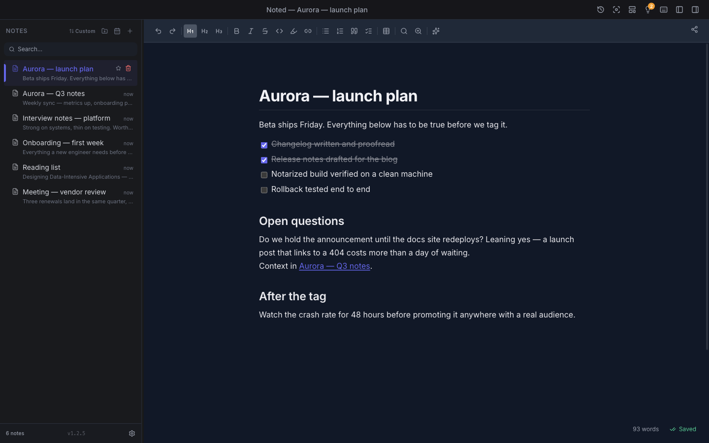
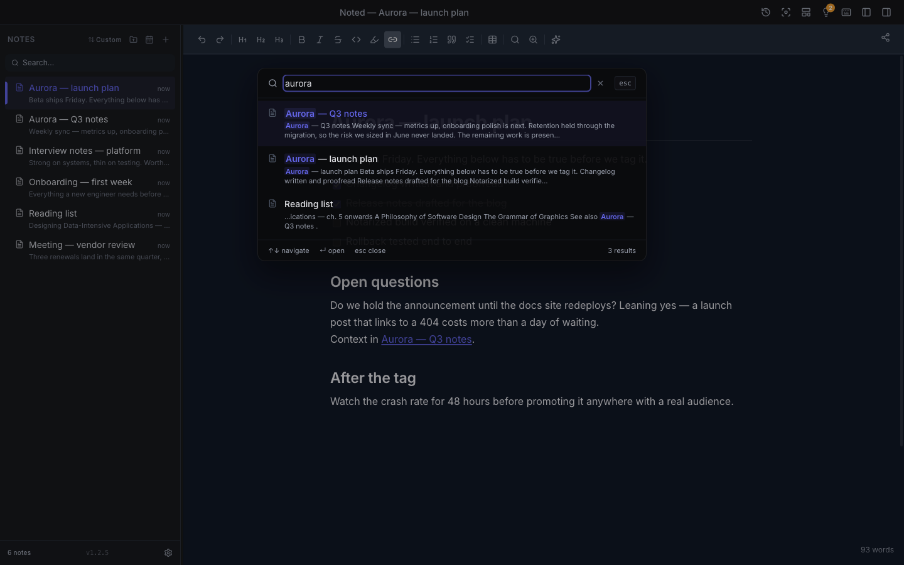
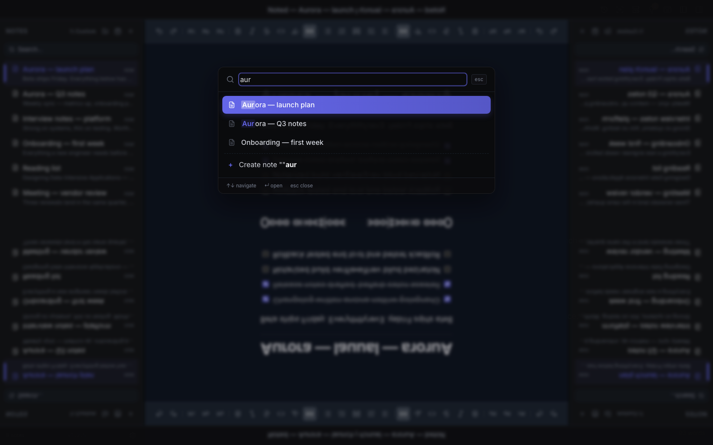

# Noted

[](https://github.com/fabriziosalmi/noted/actions/workflows/ci.yml)
[](https://github.com/fabriziosalmi/noted/releases/latest)
[](https://fabriziosalmi.github.io/noted/)
[](./LICENSE)


Noted is an open-source desktop app for taking notes in Markdown/HTML, with built-in AI, note links (wikilinks), global search, local history, and Git integration. Local-first: your notes stay on your machine, there is no account and no telemetry.

<p align="center">
  
</p>

<p align="center">
  <strong><a href="https://github.com/fabriziosalmi/noted/blob/main/docs/public/media/demo.mp4">▶ Watch the 15-second demo</a></strong>
  &nbsp;·&nbsp;
  <a href="https://fabriziosalmi.github.io/noted/">Documentation</a>
</p>

<table>
  <tr>
    <td width="50%"></td>
    <td width="50%"></td>
  </tr>
  <tr>
    <td align="center"><strong>Full-text search</strong> — every note, title and body</td>
    <td align="center"><strong>Quick open</strong> — jump anywhere by name (⌘P)</td>
  </tr>
</table>

**Documentation: [fabriziosalmi.github.io/noted](https://fabriziosalmi.github.io/noted/)** — installation, features, settings, keyboard shortcuts, the MCP server, and architecture.

## Download

Grab the latest build from the [**Releases page**](https://github.com/fabriziosalmi/noted/releases/latest):

- **macOS — Apple Silicon** — `Noted-<version>-arm64.dmg`
- **macOS — Intel** — `Noted-<version>.dmg`
- **Windows** — `Noted-<version>-x64-setup.exe`
- **Linux** — `Noted-<version>.AppImage` or `.deb`

The macOS builds are **signed & notarized** by Apple, so they open without the "unidentified developer" warning (requires **macOS 11 Big Sur or later**). Windows and Linux installers are produced automatically for each tagged release by the [build workflow](.github/workflows/release.yml); they are not code-signed yet, so expect a SmartScreen/Gatekeeper prompt on first launch. Prefer to build it yourself? See [Development setup](#development-setup).

Once installed, Noted keeps itself current: it checks for new releases on launch and offers a one-click update (**{App menu} → Check for Updates…**). Nothing downloads without your say-so.

## What it offers today

- Rich TipTap-based editor (text, headings, code blocks, tables, formulas)
- Wikilinks, backlinks, and a per-note connections panel
- Fast note switcher + global full-text search
- Multi-provider AI:
  - OpenAI
  - Anthropic
  - Gemini
  - OpenRouter
  - LM Studio (local)
  - Ollama (local)
- Inline AI suggestions, slash commands, contextual chat
- Optional PII masking before AI calls
- Git integration (status, commit, push, PR)
- Local MCP server to read/write notes from compatible MCP clients
- File-first agent workflows via MCP with an enforced runtime engine
  (`create_agent_workflow`, `append_agent_event`, `advance_agent_state`,
  `approve_agent_gate`, `reject_agent_gate`)
- Export (HTML, Markdown, PDF, DOCX) and a quick-capture window

## Tech stack

- Electron + Vite + React + TypeScript
- Zustand for state management
- TipTap for the editor
- Vitest + Testing Library for tests
- ESLint flat config
- `esbuild` for the main/preload/MCP bundles

## Requirements

- Node.js 20+
- npm 10+
- macOS (primary target)

## Development setup

```bash
npm install
npm run dev
```

`npm run dev` starts the Vite renderer and uses the Electron bundles (`main` + `preload`) generated via `esbuild`.

## Useful scripts

```bash
npm run lint        # lint with cache
npm run lint:ci     # CI lint (no cache)
npm run test        # Vitest tests
npm run test:ci     # verbose CI tests
npm run test:coverage
npm run build       # build app + electron-builder
npm run build:dmg   # build macOS DMG
```

## Distribution build

For a local (unsigned) build:

```bash
npm run build
```

For a **signed + notarized** release, add your Apple credentials to `.env.local`
(copy `.env.local.example`) and run:

```bash
bash scripts/release.sh
```

It builds, signs with your Developer ID, notarizes with Apple, and verifies the
staple. Primary output lands in `release/`.

## MCP server (Noted -> MCP tools)

Build the MCP server:

```bash
npm run build:mcp
```

Run it manually:

```bash
node dist-mcp/index.cjs --notes-dir /path/to/notes
```

If `--notes-dir` is not provided, the server tries Noted's standard macOS paths.

The MCP server also lets a Noted folder act as an agentic workspace: it
scaffolds flat notes for workflows, tasks/subtasks, runs, reviews, and output
checks, and a shared runtime engine enforces the state machine, approval gates,
and task dependencies as agents drive a workflow with `advance_agent_state` /
`approve_agent_gate` / `reject_agent_gate`. The schema, states, and gate model
are documented at
[Agent workflows](https://fabriziosalmi.github.io/noted/reference/agent-workflows).

## Repository structure (main)

- `src/` — React renderer
- `electron/` — main process + preload + git ops + ipc utils + services
- `mcp-server/` — standalone MCP server
- `shared/` — cross-process code (HTML sanitizer, frontmatter, search index, agent engine)
- `docs/` — VitePress documentation site (deployed to GitHub Pages)
- `public/` — static assets
- `dist*` — intermediate build output
- `release/` — packaging artifacts

## Quality & CI

Every push and pull request runs the full gate on GitHub Actions (Node 20 & 22):
lint, type-check, the test suite — including a locale-parity test that fails if
any of the six shipped locales is missing a key — and a cross-platform bundle
build. Release builds are signed and notarized locally (see below), never in CI.

Run the same checks locally before a PR:

```bash
npm run lint
npx tsc -b
npm run test
```

## Security (overview)

- IPC-side file/folder name validation
- Path-traversal defense (symlink-aware)
- HTML sanitization on input/output (shared DOMPurify policy across renderer, main, and MCP)
- API keys/tokens stored with Electron `safeStorage` (when available)
- `contextIsolation` on and `nodeIntegration` off in the renderer
- Navigation guards + SSRF filtering on the LLM proxy; the local MCP SSE server rejects non-local Host/Origin requests
- Release builds run with the hardened runtime and are notarized by Apple

To report a vulnerability, see [SECURITY.md](./SECURITY.md).

## License

MIT — see [LICENSE](./LICENSE).
